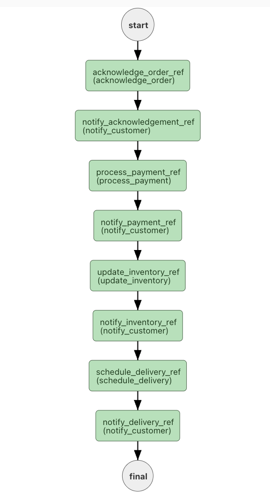
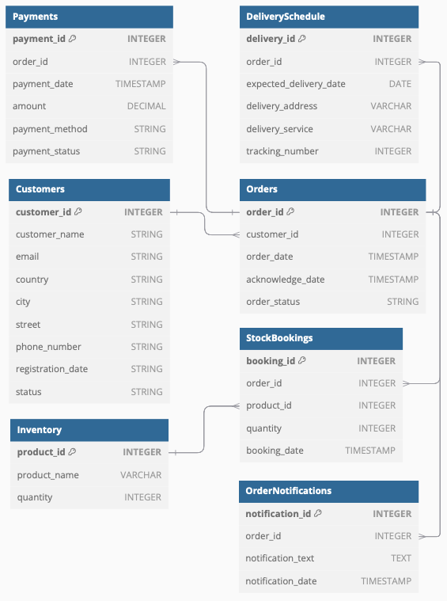

# OMS Microservice Workflow with Netflix Conductor, PostgreSQL, and Python

This project implements a **microservice-based Order Management System (OMS)** to streamline order fulfillment for an online store. Using **Netflix Conductor**, **PostgreSQL**, and **Python**, it demonstrates a minimal example of microservice workflows, offering insights into their structure and execution.

---

## Project Overview

The workflow consists of five microservices executed sequentially:

| **Microservice**                 |          **Description**                                                                            |
|----------------------------------|-----------------------------------------------------------------------------------------------------|
| **Order Acknowledgement Service**| Receives and persists customer orders in the database, returning an acknowledgment.                 |
| **Payment Processing Service**   | Processes payments and informs customers about payment status.                                      |
| **Stock and Inventory Service**  | Tracks product inventory, books stock for orders, and notifies customers about stock booking status.|
| **Shipping Service**             | Coordinates shipment, generates tracking numbers, and updates delivery statuses.                    |
| **Notification Service**         | Sends notifications to customers at various stages of order fulfillment.                            |

### Workflow Structure
The OMS follows a **linear workflow**:

1. Order acknowledgment
2. Payment processing
3. Stock booking
4. Delivery scheduling
5. Notifications

---

## Database Design

A **shared database** pattern is used with the following tables:

| **Table**                | **Purpose**                                                                                                       |
|--------------------------|-------------------------------------------------------------------------------------------------------------------|
| `orders`                 | Stores order details and unique identifiers.                                                                      |
| `payments`               | Manages transactional data for payments.                                                                          |
| `inventory`              | Tracks product inventory levels.                                                                                  |
| `stock_bookings`         | Allocates stock for orders.                                                                                       |
| `delivery_schedule`      | Tracks delivery and shipment details.                                                                             |
| `notifications`          | Manages customer notifications.                                                                                   |

---
